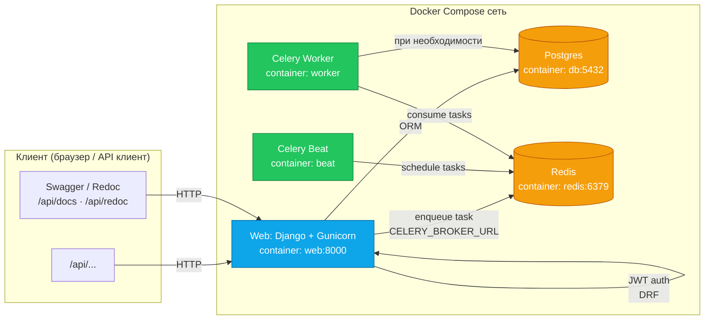
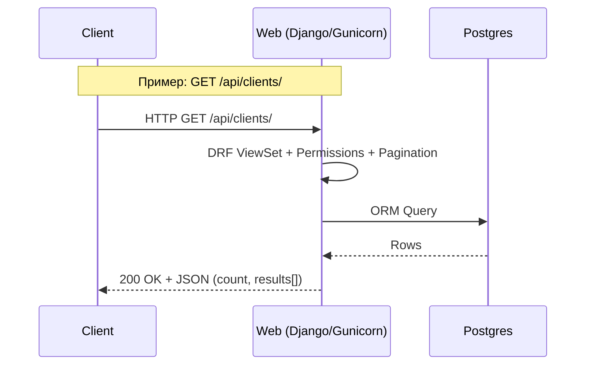
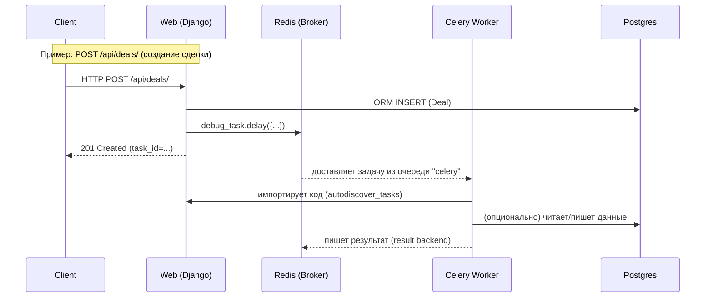
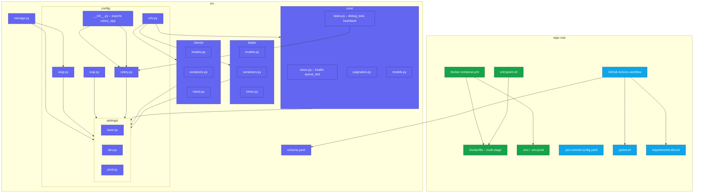
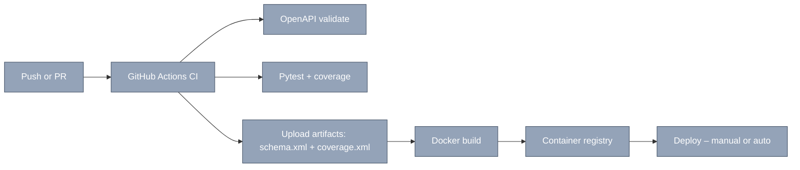

# 🏠 Home

> Быстрые ссылки: [[00_Roadmap/Roadmap_Overview]] ·

## 🎯 Roadmap — ближайшие задачи
```dataview
TASK
FROM "00_Roadmap"
WHERE !completed
SORT file.name asc
LIMIT 5
```
## 📝 Журнал — последние записи

```dataview
TABLE file.mtime as "Обновлено"
FROM "01_Journal"
SORT file.mtime desc
LIMIT 7
```

## 🔄 Недавние изменения (весь вольт)

```dataview
TABLE file.mtime as "Обновлено"
FROM ""
SORT file.mtime desc
LIMIT 5
```

# 1) Быстрые горячие клавиши (Hotkeys)
Settings → **Hotkeys** (предложение):
- Open daily note (Periodic Notes): `Alt+D`
- Open weekly note (Periodic Notes): `Alt+W`
- Insert template: `Alt+T`
- Toggle Calendar: `Alt+C`
- Quick switcher: `Ctrl+O` (по умолчанию)
- New note: `Ctrl+N`

# 2) Как работать ежедневно (короткий ритуал)
1) `Alt+D` — открыть дневную заметку → заполнить “Фокус дня”.
2) Открыть `Home.md` → блок **Roadmap — ближайшие задачи** → выбрать 2–3 задачи на день.
3) Вести время в Clockify (проекты: `amo_backup`, `graphscope`; теги: `coding`/`testing`/`devops`/`docs`).
4) В конце дня — чекбоксы, «Сделано», «Блокеры» → 2–3 строки ретро.
5) В конце недели `Alt+W` — Weekly Review: итоги, что улучшить, план на следующую неделю.

# 3) Мини-тюнинг под PyCharm
В PyCharm:
- Включи **Black** + **isort** + **Flake8**.
- Создай Run/Debug конфигурации для Django и pytest.
- Для проектов в вольте держи рядом соответствующие репозитории Git (README в `02_Projects/*/README.md` можно синкать с реальными репами).


# Структура в схемах:
##  Уровень 1 — сервисы / контейнеры



---

### Последовательность — синхронный запрос API





---

### Последовательность — отложенная задача Celery




---

## Уровень 2 — структура проекта / ключевые файлы



---

### Пайплайн CI/CD (нынешний)




```mehrmaid
graph LR
T1 --> T2 & T3 --> T4 & T5 --> T6

T1("")
T2("$\nabla_\theta \mathbb{E}_{\tau\sim p_\theta}[R(\tau)]x$")
T3("| First Name | Last Name |
| ---------- | --------- |
| Doug       | Engelbart |")
T4("#plugins/mehrmaid")
T5("[[mehrmaid]]")
T6("")
```
